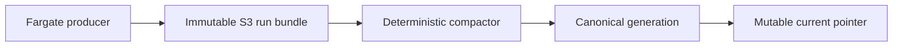

  
Engineering field manual · evidence before claims

  <h1>News signals, shaped into accountable publication.</h1>
  
Media Monitor is a contract-driven editorial pipeline: sensed facts become enriched context, human-reviewed stories, deterministic snapshots, and a public site.

  
<StatusBadge status="implemented">Implemented</StatusBadge><StatusBadge status="validated">Locally validated</StatusBadge><StatusBadge status="ready">Deployment-ready</StatusBadge><StatusBadge status="unoperated">Not yet operated on AWS</StatusBadge>

<ArtifactFlow />

## Read by intent

<LaneCard eyebrow="System / 01" title="Understand the end-to-end system" href="/architecture/system-overview">Ownership, trust boundaries, state writers, and the complete product route.</LaneCard>
<LaneCard eyebrow="Operations / 02" title="Run sensing safely" href="/operations/sensing-run-bundles">Immutable run evidence, deterministic selection, verification, and recovery.</LaneCard>
<LaneCard eyebrow="Human gate / 03" title="Follow the editorial last mile" href="/operations/editorial-human-last-mile">Move from model output to an explicit, reviewable publication decision.</LaneCard>
<LaneCard eyebrow="Case file / 04" title="Inspect AWS reliability" href="/case-studies/aws-immutable-sensing-retrofit">Why producers cannot mutate canonical state—and what remains unproven.</LaneCard>
<LaneCard eyebrow="Publication / 05" title="Review snapshot architecture" href="/case-studies/deterministic-site-publication">Deterministic identity, public projections, and deployment reconciliation.</LaneCard>

## Cloud sensing is a separate route

::: current-status Current status
The AWS sensing substrate is **implemented**, **locally validated**, and **deployment-ready**. Repository evidence does not establish a real Fargate run, S3 evidence packet, CloudWatch operation, scheduling, alarms, or ongoing AWS operation.
:::
