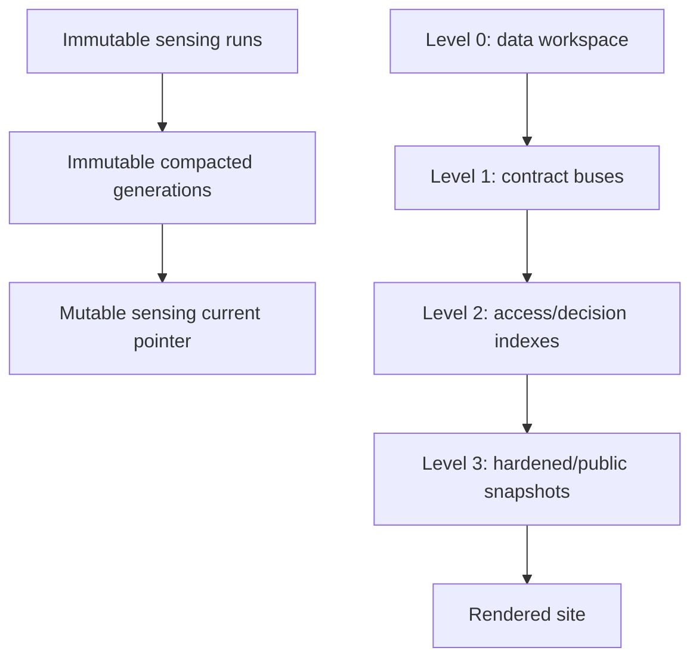

# Artifact ladder and state authority

> **Status:** canonical architecture · **Verified against:** `bf04a74`

The ladder separates mutable working state, interoperable facts, derived read models, and public projections. Sensing runs/generations form a parallel evidence path: immutable inputs are selected into a generation, then one pointer names the selected generation.

| State | Path/key | Sole writer | Mutation/replay rule |
|---|---|---|---|
| runtime workspace | `data/*` | owning stage | rebuildable/transitional; never a new integration seam |
| sensing run | `artifacts/sensing_runs/runs/<run_id>` or S3 `runs/<run_id>/` | run-bundle producer | create once; manifest/checksums then `FINALIZED`; same-key retries require identical bytes |
| sensing generation | `storage/sensing_compacted/generations/<generation>` or S3 generations prefix | compactor | content-derived generation; immutable |
| sensing current pointer | local/S3 `current.json` | compactor only | atomic/last write after complete generation |
| contract buses | `storage/buses/<schema>/v1/*` | schema's producing owner/exporter | schema-validated facts; identities deduplicate/reconcile |
| news indexes | `storage/indexes/news_*` | news index builder | replaceable derived read model |
| enrich index | `storage/indexes/enrich_*` | enrich index builder | replaceable derived status view |
| editorial pointer/index | `storage/indexes/editorial_latest.json` | editorial index builder | replaceable decision view; not approval itself |
| handoff packet | `artifacts/editorial_handoff/latest` | editorial handoff module | materialized operator view |
| published bus/indexes | published bus: promotion command; indexes: published index builder | separate fact/read-model writers | publication requires human approval; indexes remain derived |
| legacy public snapshot | `web/data/editorial_latest.json` | last-mile snapshot builder | allowlisted projection |
| source-site snapshot | `apps/news_site/public/data/site_snapshot.json` | site snapshot builder | atomic replacement; deterministic ID excludes `generated_at` |
| observability | `storage/observability/*` | run-record/heartbeat/site-roll writers by record type | evidence only; never product truth |

## Compaction selection

Only finalized, checksum-valid bundles with eligible status participate. The compactor selects exactly one deterministic attempt per digest using `(digest_at, completed_at, run_id)`, orders accepted digests, derives the generation ID from accepted fingerprints and rejections, and validates JSONL before canonicalization. A filesystem lock and atomic pointer replacement enforce one local writer.

## Denied transitions

- producer → sensing `current.json`;
- public site → internal index/bus;
- failed/unfinalized bundle → generation;
- draft generator → published article without human approval;
- compatibility wrapper → new owner authority.
