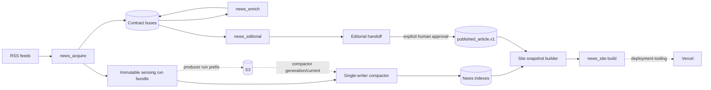

# System overview

> **Status:** canonical architecture · **Audience:** evaluator, operator, contributor, agent
> **Owner:** repository architecture · **Verified against:** `bf04a74`
> **Scope:** implemented end-to-end boundaries; not an operating runbook or provider-state record.

`media_monitor` turns sensed news into contract artifacts, editorial drafts, an explicit human approval decision, and hardened public snapshots. Local lanes share artifact contracts rather than an in-process service mesh. AWS sensing is an alternate execution substrate for the sensing producer, not a second editorial pipeline.

The solid route is the logical product path. Dashed edges show deployment/storage boundaries: the producer may upload only immutable run evidence; the compactor owns canonical sensing generations and their mutable `current.json`; Vercel receives a validated build but is not a source of editorial truth.

## Capability path and evidence

| Boundary | Writer | Output | Downstream reader | Source evidence |
|---|---|---|---|---|
| feeds → local workspace | acquire stages 01–03 | `data/*` hour artifacts | exporter/PromptFlow | `apps/news_acquire/src/news_acquire/stage0*.py` |
| workspace → contracts | `scripts/export_pr3a_buses.py` | versioned buses and export manifests | index builders/editorial/enrich | schemas plus export tests |
| isolated sensing → evidence | acquire run-bundle module | finalized `artifacts/sensing_runs/runs/<run_id>` | compactor/task uploader | run-bundle and characterization tests |
| run evidence → canonical sensing state | compactor | immutable generation plus mutable pointer | promotion/operator/downstream | compactor tests |
| PromptFlow → handoff | editorial stages/index builder | brief/draft buses, `editorial_latest.json` | human/operator | editorial pipeline/index tests |
| draft → article | promotion script after explicit flag | `published_article.v1` | published indexes/site | schema and promotion tests |
| indexes → deployment snapshot | site snapshot builder | `site_snapshot.v1` | validator/Next.js | snapshot and site-roll tests |

## Runtime shapes

- **Local:** Make targets and owner entrypoints write local `data/`, `storage/`, and `artifacts/` paths.
- **AWS sensing:** ECS/Fargate producer writes a unique S3 run prefix. Separate compactor authority may write generations/current state. Terraform is deployment-ready; no provider operation is claimed.
- **Publication/site:** builders turn internal indexes and approved article buses into allowlisted snapshots. Deployment tooling can send a prebuilt Next.js result to Vercel; repository evidence does not establish a live deployment.

## Failure boundaries

A failed stage stops its lane and records/quarantines evidence; it must not make an unfinished run eligible for compaction. Invalid checksums, missing `FINALIZED`, bad status, unsafe paths, or missing candidates reject a sensing bundle. Publication refuses a draft without `--approve-human`. Snapshot builders validate schema, digest coherence, freshness/selection rules, and source hashes before atomic replacement.

See [lane and owner boundaries](lane-and-owner-boundaries.md), [artifact ladder and state](artifact-ladder-and-state.md), [identity/provenance/replay](identity-provenance-and-replay.md), and [trust boundaries](trust-boundaries.md).
